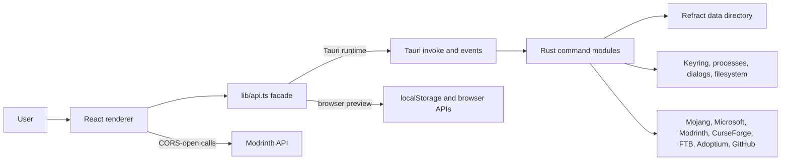

---
aliases:
  - Refract Project Knowledge
  - Refract Knowledge Base
tags:
  - refract
  - minecraft-launcher
  - project-knowledge
  - architecture
status: living
created: 2026-07-19
updated: 2026-09-30
project_version: 1.4.0
repository: https://github.com/RefractMC/Refract_MC
---

# Refract project knowledge base

> [!abstract] Purpose
> This is the shared, Obsidian-friendly source of truth for people and AI assistants working on Refract. It describes the project as implemented in the repository, not only as advertised. Update it whenever architecture, commands, persisted data, release steps, or major features change.

> [!info] Snapshot
> Reviewed for the 1.4.0 release on 2026-08-22. The root `package.json` version is older and is not the desktop release version.

## Quick facts

| Item | Value |
| --- | --- |
| Product | Refract, an open-source Minecraft Java Edition launcher |
| Primary runtime | Tauri 2 desktop shell with a Rust backend |
| UI | React 19, TypeScript, Vite 8, Tailwind CSS 4 |
| Routing and server state | TanStack Router and TanStack Query |
| Local UI state | Zustand with localStorage persistence |
| Monorepo | pnpm workspaces |
| Platforms | Windows, macOS Intel/Apple Silicon, Linux |
| License | GPL-3.0 |
| App identity | `com.refract` |
| Custom URL scheme | `refract://` |
| Canonical repository | https://github.com/RefractMC/Refract_MC |
| Website | https://refractmc.net |

The product goal is a focused launcher that owns instance organization, Minecraft installation and launch, accounts, Java runtimes, community content, worlds, screenshots, servers, skins, themes, updates, and diagnostics.

### Official website source

The website is maintained separately in [RefractMC/Refract_net](https://github.com/RefractMC/Refract_net).
The local `website/` directory is an independent checkout with its own Git history, pnpm workspace,
and GitHub Pages workflow. Run website commands from that directory; do not add it as a launcher
workspace package. Its Astro static pages share a normalized GitHub data layer for release assets,
repository statistics, and contributors, with browser revalidation and server-only optional tokens.
The home page progressively loads an original Three.js voxel scene; documentation remains static
with a local search index. See `website/README.md` for development and deployment details.

### Storage and operation guarantees

Portable pack path checks, instance identity/ownership checks, fail-closed vault
initialization, checked override copies and asynchronous event cleanup are now implemented.
Exact loader profiles and shared JSON persistence with recovery backups are also
implemented. Shared artifact ownership, verified replacement and staged Java
provisioning are implemented too. Planned modpack snapshots and interrupted-update
recovery are now implemented. Authentication uses typed recovery errors and per-account
refresh ownership. Remaining gaps include provider/native rollback verification,
multi-file metadata transactions, secondary JSON stores, operation ownership across
all native mutations, cancellation through every provider stage and native verification.

## Mental model



The most important architectural rule is: UI components call the stable `api.*` facade in `apps/renderer/src/renderer/src/lib/api.ts`. They should not invoke arbitrary Tauri commands directly. Rust commands are registered centrally in `apps/tauri/src-tauri/src/lib.rs`.

## Repository map

| Path | Responsibility | Notes |
| --- | --- | --- |
| `apps/renderer` | Shared React renderer | The live UI source is nested under `src/renderer/src`. |
| `apps/tauri` | Production desktop application | Vite host plus the Rust/Tauri backend. |
| `packages/core` | Shared TypeScript models and helpers | Contains instance/content types and some older Node-oriented launcher code. Rust is authoritative for native runtime behavior. |
| `packages/plugin-api` | Minimal public plugin type contract | Interfaces exist, but no complete runtime plugin loader is present. |
| `locales` | Translation JSON | English is the schema/fallback; Ukrainian and Simplified Chinese are registered. |
| `logo` | Brand and README assets | Includes icons and the current screenshot. |
| `packaging/aur` | Arch User Repository package | Binary package consumes the stable RPM release asset. |
| `packaging/{homebrew,scoop,chocolatey,nixpkgs}` | Upstream package submissions | Manifests and a source-built nixpkgs expression; refresh with `packaging/scripts/update-packages.py`. |
| `packaging/msix` | Optional Windows MSIX package | Certificate-gated `makeappx`/`signtool` workflow; NSIS/MSI and updater remain authoritative. |
| `flake.nix`, `nix/package.nix` | NixOS package and development shell | Builds the native app from source and supplies Java and Minecraft runtime libraries. |
| `.github/workflows` | Build, audit, release, AUR, and Discord automation | CI uses Node 24 and pnpm 11. |
| `README.md` | Product overview and public setup | Start here for users. |
| `CONTRIBUTING.md` | Contributor rules and checks | Keep changes focused and report verification. |
| `apps/tauri/RELEASING.md` | Release operations | Signing, publishing, and AUR automation. |
| `CHANGELOG.md` | User-visible release history | Add short, concrete release entries. |
| `SECURITY.md` | Vulnerability reporting and audit exceptions | Security reports should be private. |

### Important source entry points

- Renderer boot: `apps/renderer/src/renderer/src/main.tsx`
- Root layout: `apps/renderer/src/renderer/src/routes/__root.tsx`
- App shell: `apps/renderer/src/renderer/src/components/layout/AppShell.tsx`
- API boundary: `apps/renderer/src/renderer/src/lib/api.ts`
- Renderer API types: `apps/renderer/src/renderer/src/env.d.ts`
- Generated route tree: `apps/renderer/src/renderer/src/routeTree.gen.ts`
- Tauri boot: `apps/tauri/src-tauri/src/main.rs` and `lib.rs`
- Tauri configuration: `apps/tauri/src-tauri/tauri.conf.json`
- Native capabilities: `apps/tauri/src-tauri/capabilities/default.json`
- Core instance model: `packages/core/src/instance-manager/index.ts`

## Runtime behavior

### Startup

1. Tauri creates a maximized, centered, frameless `1280 x 800` main window with a `900 x 600` minimum.
   The window is declared in `tauri.conf.json` with `create: false` and built transparent in
   `window_appearance.rs` from that config, so see-through themes can switch live (see Themes).
   The window starts hidden while native initialization creates a localized Show/Quit tray menu.
   It stays in the tray only when both `startMinimized` and `minimizeToTray` are enabled;
   otherwise it is shown. A missing tray uses taskbar minimization for background startup.
2. The single-instance plugin focuses the existing window when a second process starts.
3. Deep links, dialogs, updater, and process plugins are registered.
4. Linux requests WebKitGTK's shared-memory renderer transport by default to avoid hardware DMA-BUF freezes while keeping accelerated compositing available where supported. Explicit `WEBKIT_DISABLE_DMABUF_RENDERER` or `WEBKIT_DMABUF_RENDERER_FORCE_SHM` environment variables take precedence.
5. Analytics initializes, but sends nothing if the build has no `GA_API_SECRET` or the user opted out.
6. A blocking worker attempts recovery of interrupted instance updates/restores before Quick Play launches. Pending recovery blocks guarded mutations and launches, including alternate instance IDs that share the affected folders. Failed recovery can be retried from the global recovery notice.
7. React initializes error logging and the persisted theme, then mounts a hash router and Query client.
8. The renderer updater checks GitHub Releases, rechecks every 30 minutes while the app stays open, and exposes a manual check in Settings. Download and install failures are returned to the UI for retry instead of being log-only.

Native `window_lifecycle.rs` handles main-window close requests. With `minimizeToTray`
enabled, it hides to an available tray or minimizes to the taskbar. Linux checks for a
StatusNotifier tray host before hiding. A successful game spawn applies
`launchMinimizesToTray`; the last tracked game exit applies `reopenOnGameExit`.
Queued actions verify their operation identity on the main thread so a delayed hide
does not override an already-finished game. Tray and Settings expose an explicit Quit.
Tray labels follow the renderer language, and window failures have a global notice.

A real window/tray/settings quit first acquires exclusive maintenance and emits
`window://quit-requested` with a request ID and `skipUpdate` flag. Active shared work
rejects quit or update installation with a global notice. The process-wide renderer
listener acknowledges the ID before installing a downloaded update or finalizing quit.
Hiding does not run the installer. A WebView that never acknowledges allows a five-second
fallback; claiming that exit is atomic with respect to acknowledgement and installation.
Manual and quit-driven installs share one renderer job. A single `updater_install`
command acquires or transfers the quit owner and moves it into a blocking native worker
that retains exclusive maintenance, the resource and its operation lock through installation
and restart. Dropping the IPC waiter cannot release them. Native failure cleanup releases
only that worker's matching request and keeps the app open for retry or Quit without updating.
An installed resource retries restart without reinstalling. Renderer cancellation can clear
only a waiting/ready handshake, never an installer. An acknowledged handshake that never
starts installation or finishes quit expires after 30 seconds and reports recovery; an active
installer never loses ownership merely because time elapsed.
OS-level ExitRequested uses the same handshake; approved final exit and restart pass through.
`app_updates.rs` creates update resources using the configured release endpoint and public
key, with shared maintenance ownership for checks and downloads. It preserves Tauri resources during the Windows
pre-launch hook so a rejected installer launch can still return to a usable window/tray.
The Rust updater is 2.13.1 (checked Windows launch), and the required Tauri runtime/direct
JS API are 2.12.0. All renderer updater-plugin permissions, direct restart and window-destroy
permissions are removed. The facade calls only Refract's native updater commands. Each native
resource owns its SDK handle, verified bytes and installed state; download/install attempts
on the same resource cannot overlap. Download completion and installable bytes are published
only after SDK signature verification returns successfully, not from its earlier transfer-finished
callback. IPC exposes resource ID/display versions and channel progress, never installer bytes
or renderer-controlled endpoints. The facade validates metadata before constructing its handle.
Checks have a 20-second total timeout; downloads have a 30-minute total
timeout, with 20-second connect and 30-second read limits. Native checks also honor the
build-time `REFRACT_UPDATER_ENABLED=false` used by Nix.
Installer-stall diagnostics/recovery, reconnecting UI state after renderer loss, exhaustive
operation coverage and native/cross-platform verification
remain unfinished. Dependency/source checks do not prove real Windows installer recovery.

### Create, install, and launch

1. Creating an instance writes `instance.json`, assigns a UUID, creates a safe folder name, and initializes playtime and mod metadata.
2. Installing Minecraft downloads the version JSON, client jar, allowed libraries, natives, and assets. Required download and native extraction failures abort the install, and `isInstalled` is cleared before work begins and set only after the full pipeline succeeds. Fabric/Quilt use loader overlays; Forge/NeoForge run their installer processors.
3. Minecraft, content and Java artifact downloads use the shared Rust engine with connection pooling, bounded concurrency, retries, unique owned `.part` files, and hash/size verification. Canonical destination locks serialize competing writers and revalidate existing files after acquisition. Publication replaces the final file without deleting its predecessor first. The shared client validates each redirect before requesting it, bounds header/body/total time, and polls cancellation during requests, streams, ownership waits and retry backoff. Other metadata/provider callers still need migration and operation cancellation wiring.
4. Launch resolves the active account, refreshes authenticated tokens inside Rust, chooses or downloads a compatible Java runtime, merges loader metadata, builds JVM/game arguments, runs optional pre-launch hooks, and starts Minecraft. Automatic Java selection uses loader metadata plus legacy Forge constraints, never falls back to an incompatible installed major, and treats a configured per-instance Java path as an explicit override.
5. Output streams over `mc://log`; exit state streams over `mc://exit`. Playtime is added to lifetime and local-calendar-day totals.
6. Optional Quick Play targets open a saved world or server directly. Optional offline launch skips token refresh.

Minecraft installation and launch share one Mojang metadata rule evaluator. It applies operating-system name, architecture and version regexes, last-match allow/deny ordering, and the active resolution and Quick Play feature flags. Native `${arch}` classifiers use the current target bitness, while explicit ARM64 classifiers remain unchanged.

Instance duplication and external-launcher imports use checked recursive copies for their selected content directories. Linked filesystem entries are rejected, failures identify the affected path, and a newly created destination is removed instead of being left registered as a successful but incomplete copy.

Legacy `minecraftArguments` templates are tokenized before placeholder substitution so quoted values and resolved paths containing spaces retain their intended argument boundaries. Malformed quoted templates stop launch with an explicit error.

Forge and NeoForge installation fail when required library downloads, embedded Maven copies, processor JARs, classpath entries, arguments, or declared outputs are invalid. Processor outputs with declared SHA-1 hashes must match before reuse and after execution, and loader metadata is written only after all installation stages succeed.

Minecraft repair rebuilds the required artifact plan from current Mojang and loader metadata. It verifies cached libraries and every content-addressed asset against its declared hash, re-downloads missing or corrupt files, refreshes the client and native archives, reruns loader installation, and only restores `isInstalled` after the full pipeline succeeds. Ordinary installs may trust existing content-addressed assets for faster shared-cache reuse; the explicit repair path does not.

`minecraft_metadata.rs` validates the required client, library, native and asset-index
records before artifact downloads. Modern artifacts require allowed HTTPS URLs,
portable contained paths, SHA-1 hashes and unsigned byte sizes. Explicit legacy Maven
records remain supported without inventing modern download fields; native-only records
produce native archives rather than classpath JARs. The asset index is bounded to 64 MiB,
verified against its original bytes and checked for a valid objects map before publication.
Conflicting destinations, malformed rules, hashes, sizes or required records stop installation.
Version and index JSON are published after required artifacts, asset copies and loader
installation succeed. Forge receives the validated Java requirement directly.
Legacy virtual assets and pre-1.6 resources are copied from verified objects to checked
destinations with atomic file replacement and cancellation checkpoints. Native extraction
runs on owned blocking workers, honors exclusions and writes into the resolved game root.
This does not make the entire shared cache one transaction or replace native launch testing.

Renderer-controlled content filenames are restricted to a single safe path component before mod toggle/delete operations; traversal and absolute paths are rejected.

World delete/backup and screenshot open/read/rename/delete commands canonicalize direct children and reject symlinks and Windows reparse points. Screenshot renames preserve the original image extension and reject nested, reserved-character, empty, and overlong names. World backups also reject linked entries found during recursive traversal.

World imports validate archive paths before creating the destination, extract into a
private stage beside `saves`, and publish a complete world under a new name. Failed extraction
or cancellation removes that stage. Backups stream required files into a synced temporary
archive and replace the chosen destination only after successful completion; unreadable
files fail the backup. A backup destination inside the world is rejected. These guarantees
do not yet provide automatic backup retention or recovery of staging left by process crashes.
World size enumeration runs on a blocking worker and uses an iterative traversal that
does not follow symlinks or Windows reparse points.

### Content installation

- Modrinth is CORS-open, so project search/detail requests can run in the renderer. Native code still owns downloads and filesystem writes.
- CurseForge and FTB calls go through Rust because CurseForge needs an API key and both need native/CORS handling.
- Mods, resource packs, shaders, and datapacks are installed per instance.
- Individual Modrinth content updates download to verified staging files, retain the old file until the replacement and one consolidated metadata write succeed, and restore committed files if metadata persistence fails. Successful updates persist the new version, filename, size, URL, and hashes for later verify/repair operations.
- Required dependencies are resolved recursively; optional dependencies can be selected by the user.
- CurseForge files with API distribution disabled use the supported manual flow: Refract opens the official download page and watches the Downloads directory for the expected file/hash. It does not bypass author restrictions.
- Modpacks support Modrinth `.mrpack`, CurseForge manifests, FTB packs, and local archive imports.
- Local archives recognize one export format before validating it. Malformed or conflicting Modrinth, CurseForge, Refract and MultiMC/Prism metadata fails instead of becoming a plain-folder import. Metadata reads are bounded to 4 MiB. A plain archive without authoritative version metadata returns `needsVersion`; the Library asks for an explicit Minecraft version, including legacy releases. `modpack_install_from_file` accepts optional `minecraftVersion` and returns a checked `installed`/`needsVersion` result; the version argument cannot repair malformed recognized metadata or override its declared version. Blocking extraction/copy workers retain both private staging guards until they finish.
- Each pack import owns unique archive/extraction storage. Native operation ownership starts before preparation, then attaches private staging and newly created instances before publishing their metadata. Modrinth/FTB/Mojang pack metadata and shared artifact downloads use the operation's cancellation token; other provider and loader stages still require migration.
- Modpack updates validate archive manifests and override paths before mutation. The write plan includes the replaced mod set, extracted natives and every manifest/override game root, including arbitrary configuration files and folders. Packs cannot override saves, screenshots, logs or reserved recovery paths. Linked external updates remain unsupported.
- Before an update, Refract copies the planned roots and instance metadata into synced snapshot storage, then publishes a transaction journal. Version 2 snapshots include SHA-256 payload and metadata checks; version 1 snapshots remain readable. Normal failures await rollback, while interrupted processes leave a journal for recovery. Recovery validates the instance's storage identity, stages and verifies every saved payload before replacing live roots, and restores the metadata document while preserving current identity/storage locators. Missing-before-update roots are removed. Recovery can resume after a partial restore; failed recovery keeps mutations blocked and the backup available.
- Manual snapshot restore uses the requested snapshot's exact path inventory for its safety snapshot and journal. Retention targets five complete snapshots, protects the active rollback point, and reports failures. Pack success is emitted only after metadata and journal finalization; nested Minecraft installation does not independently emit success. Shared override copies publish synced files atomically and report required-copy errors. Native provider flows, power-loss behavior and cross-platform recovery verification remain audit work.

## User-facing areas

| Route | Page | Main responsibilities |
| --- | --- | --- |
| `/` | Library | Instances, groups, search/filter/pinning, install/launch/stop, console, crash reports, imports, external launcher sync, bulk actions, updates, activity, and playtime. |
| `/browse/` | Browse Mods | Modrinth and CurseForge mod search, filters, details, dependency planning, install, blocked-file flow, and update checks. |
| `/news/` | Minecraft News | Official Minecraft news fetched and sanitized by Rust. |
| `/modpacks/` | Content | Modpacks plus resource packs, shaders, and datapacks; sources include Modrinth, CurseForge, and FTB. |
| `/creator/` | Creator Mode | Secure Modrinth connection, per-instance listing drafts, `.mrpack` generation, project/version publishing, and moderation submission. |
| `/skins/` | Skins | Local skin library, 3D preview, classic/slim variants, and applying to Microsoft accounts. |
| `/account/` | Accounts | Microsoft device-code auth, offline accounts, Yggdrasil, active-account selection, session validation, skins, and capes. |
| `/settings/` | Settings | Memory, Java, themes/layout/accent, language, launch behavior, CurseForge key, privacy, logs, links, and destructive data reset. |

The sidebar also owns the friends panel, account summary, Discord link, and compact/expanded state.
World sharing is initiated from instance details. Refract resolves and installs the exact e4mc build plus required Modrinth dependencies for an existing Fabric, Forge, NeoForge, or Quilt instance, launches it, then detects the temporary `e4mc.link` address from `mc://log`. World and saved-server invites use validated `refract://join/server` deep links. Accepting an invite requires confirmation and a compatible installed instance before Quick Play launch.

Server invites can be kept as linked records. Linked records live outside Minecraft's `servers.dat`, are merged into server reads, and retain a stable link ID for a future account-backed synchronization relay. The current implementation shares links out of band and does not provide remote friend delivery or live relay updates.


## Renderer architecture

### Data and state

- TanStack Query caches server/native reads. Default `staleTime` is 30 seconds, garbage collection is 5 minutes, focus refetch is disabled, and one retry is allowed.
- `hooks/use-instances.ts` defines the standard instance queries/mutations and invalidates `['instances']` after writes.
- Zustand persists these browser-side stores:
  - `refract-theme`: selected theme, custom theme metadata, layout overrides, sidebar state, accent.
  - `refract-language`: `en`, `uk`, or `zh-CN`.
  - `refract-avatars`: local offline-account avatar data URLs.
- Some page-specific selections and filters also use localStorage.
- Creator Mode stores non-secret per-instance publishing drafts in localStorage. Modrinth tokens never enter renderer storage.

### API facade modes

`lib/api.ts` chooses its implementation by checking `window.__TAURI_INTERNALS__`:

- Tauri mode maps typed `api.*` methods to native `invoke` commands, dialogs, window APIs, updater APIs, and event listeners.
- Native event wrappers use `ownSubscription` to suppress callbacks immediately on cleanup and detach registrations that resolve later. Registration and detach failures go to the renderer logger.
- Browser-preview mode uses browser APIs and localStorage for a limited preview experience. It is useful for UI work but is not proof that native install, launch, auth, filesystem, or updater behavior works.
- `tinvoke` normalizes both legacy Rust string errors and structured IPC errors into JavaScript `Error` objects so the UI can display them consistently. Structured payloads become `RefractError` instances with a stable code, retryability, and safe context. Minecraft install/repair, authenticated launch, sign-in/validation/logout and authenticated skin/cape commands preserve these errors. The renderer uses authentication codes for localized recovery actions instead of matching English provider text.

### Internationalization

- English `locales/en.json` is the complete schema and fallback.
- Ukrainian and Simplified Chinese are recursively merged over English, so missing keys fall back safely.
- `{{parameter}}` placeholders are expanded by the typed wrapper in `i18n/index.ts`.
- To add a locale: create a BCP 47 JSON file, import/register it in `i18n/index.ts`, extend the `Lang` union in `stores/language.ts`, and add its Settings selector.
- User-visible text should live in locale files. A few existing hard-coded strings remain; do not copy that pattern into new UI.

### Themes

- Built-in definitions are `lib/themes/dark.json` and `light.json`.
- The theme engine translates theme JSON into CSS variables.
- Custom theme JSON files are stored natively under the data directory's `themes` folder.
- Theme colors accept `#RRGGBBAA`; opaque colors keep the `#RRGGBB` form, so existing themes are unchanged. The editor adds a 0-100% alpha slider to every color.
- A Background (`bg-base`) alpha below 100% makes the window see-through, live and without a restart. The main window and webview are always created transparent; opaque themes still paint opaque backgrounds, so they look as before. An initialization script reports native support (`api.window.transparencyActive()`), and the theme engine then sets `html[data-window-transparent]` and toggles the native backdrop through `window_set_backdrop`: Mica (Windows 11), Acrylic (Windows 10), or vibrancy (macOS). Linux relies on the compositor. `REFRACT_DISABLE_WINDOW_TRANSPARENCY=1` creates an ordinary opaque window for systems that render it incorrectly. macOS builds enable Tauri's `macos-private-api`, which rules out Mac App Store distribution.
- `prefers-reduced-transparency` forces solid root, chrome and panel fills through the engine's `--bg-opaque` and `--surface-opaque` variables.
- The persisted accent override is reapplied to built-in themes.
- Global tokens and compatibility styles live in `styles/globals.css`.

### Log privacy and sharing

Game and shell-hook stdout/stderr use one native filter before `mc://log` emission.
It censors the session token, account identifiers and instance/home paths, plus common
credential patterns. Whole lines over 16 KiB are omitted rather than split into potentially
sensitive fragments. Each stream limits ordinary output to 100 entries and 64 KiB of
filtered text per second, plus omission markers and framing. Hook output drains through pipes instead of collecting
the whole process output in memory; hook cancellation/deadlines still need F11 work.

Native authentication remembers up to 128 recently used secret values solely for filtering.
Those bounded copies use zeroizing storage and expire after 30 minutes on the next cache
access; active session censors retain their own values until their output readers finish.
Logging does not unlock or enumerate the vault. Pattern filtering also covers older logs,
but unknown, encoded or arbitrarily formatted sensitive content still requires user review.
Minecraft's original log files are not rewritten.

Launcher log writes/clear/rotation serialize on one lock. Rotation publishes through the
shared atomic writer; reads seek into at most 2 MiB and return at most 1,000 shaped entries.
Crash reports use bounded, filtered reads on a blocking worker. Renderer storage is capped
at 200 entries/256 Ki characters, native forwarding at eight pending writes, and console
history at ten recently active instances with 256 Ki characters each (128 Ki pending).
The API facade explicitly connects renderer logging to the native writer.

`mc.previewLog` prepares filtered text locally and returns a one-use preview ID, text and
truncation flag. The dialog requires an explicit upload action; `mc.uploadLog(previewId)`
sends that exact immutable text, never a fresh read of the original file. Closing discards
the preview; delayed preview responses are discarded after cleanup. Native storage holds
at most four previews for ten minutes, with two simultaneous reads/uploads. Upload transport
rejects redirects, bounds time and response size, and accepts only HTTPS mclo.gs share links.
The original instance-config dump and local Java paths are excluded from copied diagnostics.
Successful reset clears in-memory log previews, remembered privacy-filter secrets,
operation history, Java detection results and storage recovery notices while it still
owns exclusive maintenance.

### Destructive reset

Settings opens a localized review dialog before `launcher_delete_all({ options })`.
Both `deleteAccounts` and `unlinkExternalInstances` are required booleans, initially
unchecked. The command now lives in `reset.rs`; the browser preview refuses it.

Reset removes managed instance payloads, managed Java, themes/plugins, shared assets,
libraries/versions, cache, logs, snapshots and saved skins. It removes linked-server,
running-session, skin-manifest, friends, activity and analytics JSON plus recovery
siblings. It resets preferences, including the user-configured CurseForge key, while
preserving the existing analytics choice. Accounts and connected-service credentials
are kept unless selected for deletion. Unknown top-level files are preserved.

Custom instance and linked game files are never reset targets. Their registrations and
managed linked-instance wrappers remain unless unlinking is selected. Reset checks
canonical overlaps, refuses links/reparse points in deletion trees, rejects unsupported
instance schemas and stops before deletion when instance ownership cannot be read.
External metadata is inspected without invoking recovery writes. Retained instances
may need repair or Java reconfiguration after the shared cache/runtime reset.

`maintenance.rs` provides shared leases for native operations, Java/runtime ownership,
auth/vault, independent mutations, persistence, downloads and their blocking workers.
Reset acquires exclusive ownership before any data access and keeps it in its worker
even if IPC stops awaiting the result. New shared work is rejected during maintenance.
Native quit and manual-update handshakes now retain exclusive ownership through final exit
or reported failure. They exclude reset and guarded shared work in either direction.
This coordinates the running process, not games surviving a prior launcher exit or
untracked external programs. Raw updater plugin calls remain permitted for the facade;
this is not a claim of protection against a compromised renderer bypassing the facade.

File failures are reported and retain account/registry metadata. Managed instance
identity is deleted after its payload so a locked game file permits a later retry.
Selected account removal clears the in-memory Stronghold, deletes the snapshot before
its OS key, and reports either failure; a failed snapshot deletion preserves the key.
Successful config/registry reset publishes the new state to primary and backup copies,
then removes corruption copies. These steps are not a cross-file crash-atomic transaction;
durable partial-reset recovery remains part of F04/F11.

After native success the dialog cancels queries, removes `refract.`/`refract-` local and
session storage, clears the query cache and reloads the renderer into first-run setup.
Storage failure keeps a completion retry visible and never repeats native deletion.
The review prevents dismissal while working, returns focus on cancellation and waits
for queued/debounced Settings saves. Native desktop, real keyring, cross-platform and
visual/keyboard/zoom verification remain required; automated reset tests use temporary
roots and a mock vault, never personal launcher data.

## Native backend module map

| Module | Responsibility |
| --- | --- |
| `activity.rs` | Persistent recent activity entries. |
| `analytics.rs` | Opt-out Google Analytics Measurement Protocol events with a generated anonymous client ID. |
| `auth.rs` | Microsoft device-code OAuth, Xbox/XSTS/Minecraft token chain, refresh, offline accounts, Yggdrasil, and safe account records. |
| `auth_session.rs` | Child of `auth`: bounded authentication transport, typed failure classification, per-account ownership and refresh-token persistence. |
| `cf.rs` | CurseForge file metadata/downloads and manual blocked-file resolution. |
| `config.rs` | Defaults, forward-compatible config merge, and generic config get/set. |
| `content.rs` | FTB and CurseForge API proxy plus Fabric/Quilt version lookup. |
| `creator.rs` | Secure Modrinth account connection and project/version publishing for generated `.mrpack` archives. |
| `discord.rs` | Discord Rich Presence lifecycle for running games. |
| `downloader.rs` | Shared verified parallel download engine and install statistics. |
| `error.rs` | Serializable structured IPC error payloads and domain classification. |
| `external.rs` | Prism, MultiMC, Modrinth App, ATLauncher, CurseForge, and GDLauncher discovery/link/import. |
| `forge.rs` | Forge/NeoForge version resolution, installer extraction, libraries, and processors. |
| `friends.rs` | Friend records and Mojang profile lookup. |
| `gamedata.rs` | Worlds, backups/import, crash reports, logs, screenshots, and option copying. |
| `instances.rs` | Instance CRUD, safe folder naming, registry, exports, duplication, deletion, and playtime. |
| `java.rs` | Java detection, version requirements, managed/custom runtimes, and Adoptium downloads. |
| `launch.rs` | Authenticated launch arguments, loader overlays, hooks, owned process watchers, checked stop/exit, logs, and Quick Play. |
| `links.rs` | HTTPS host allowlist for external links. |
| `log.rs` | Serialized bounded launcher log writes, shaped reads and atomic rotation. |
| `log_privacy.rs` | Native credential/path filtering, bounded line/tail readers and output throttling. |
| `log_share.rs` | Safe log selection, immutable expiring previews and checked mclo.gs uploads. |
| `maintenance.rs` | Shared native-work leases and exclusive destructive-maintenance ownership. |
| `app_updates.rs` | Native update-resource creation, safe pre-launch hook, metadata contract and network deadlines. |
| `mc_install.rs` | Vanilla and loader installation, repair, cancellation, and progress. |
| `modpack.rs` | Modrinth, CurseForge, FTB, and local archive modpack install/update/import. |
| `modpack_import.rs` | Recognized local archive schemas, checked import plans and explicit plain-archive version selection. |
| `mods.rs` | Per-instance content listing, install, toggle, delete, verify/repair, updates, profiles, and `.mrpack` export. |
| `net.rs` | Network helper layered on the shared downloader. |
| `operations.rs` | Per-instance native operation IDs, scoped ownership, cancellation, events and bounded in-memory history. |
| `news.rs` | Official Minecraft news API/scrape fallback, sanitization, and URL validation. |
| `paths.rs` | Stable data directory and shared assets/libraries/versions paths. |
| `procutil.rs` | Platform process helpers such as hiding Windows console windows. |
| `reset.rs` | Explicit reset policy, external-data protection, checked deletion and completion. |
| `rules.rs` | Shared Mojang operating-system, architecture, version, feature-rule, and native-classifier evaluation. |
| `secrets.rs` | Stronghold vault protected by a random master key stored in the OS keyring. |
| `window_lifecycle.rs` | Native tray, close/start/game window behavior, localized menu and acknowledged quit handling. |
| `servers.rs` | `servers.dat` NBT parsing, linked-server persistence/validation, and Minecraft server-list ping. |
| `shortcuts.rs` | Desktop Quick Play shortcuts and command-line parsing. |
| `skins.rs` | Local skin library plus Minecraft skin/cape APIs. |
| `snapshots.rs` | Persistent pre-change instance snapshots, retention, safe restore, and rollback commands. |
| `system.rs` | Total and available physical memory. |
| `theme.rs` | Custom theme file install/list/delete and background selection. |

## Native API domains and events

The full TypeScript contract is in `env.d.ts`; this table is the working index.

| Domain | Representative operations |
| --- | --- |
| `analytics` | Track allowlisted events. |
| `activity` | List and add activity. |
| `news`, `discord`, `external` | Fetch/open trusted links. |
| `config`, `theme`, `system`, `log` | Settings, themes, memory, and logs. |
| `friends`, `skins` | Friend metadata and local/remote appearance. |
| `auth` | Account CRUD, Microsoft begin/complete, validate, Yggdrasil, skins/capes. |
| `instance` | CRUD, folders, duplicate, import/export, external discovery/link/import. |
| `modrinth`, `curseforge`, `ftb`, `modpack`, `mods` | Browse, resolve, install, update, verify, profiles, and export. |
| `creator` | Import a Modrinth token into Stronghold, report safe connection state, publish projects/versions, and stream progress. |
| `mc` | Versions, loaders, Java scan, install/repair, launch/stop, worlds, logs, screenshots, servers, shortcuts. |
| `java` | Managed runtimes, requirements, ensure/download/delete, and custom runtime paths. |
| `operations` | List/get/cancel native operation records and subscribe to their changes. |
| `window`, `updater` | Frameless window controls and application update lifecycle. |

Important native event channels:

| Event | Payload purpose |
| --- | --- |
| `mc://progress` | Minecraft/loader install step and percentage. |
| `mc://log` | Per-instance stdout/stderr lines. |
| `mc://exit` | Process exit code or launch error. |
| `java://progress` | Managed Java preparation with major, step, percent and running/succeeded/failed state. |
| `operations://changed` | Operation ID, nullable primary instance ID, all attached public instance IDs, kind, state, cancellation request and timestamps; no account credentials or file paths. |
| `modpack://progress` | Modpack installation phase. |
| `modpack://done` | Installed instance ID, error, and measured statistics. |
| `cf://blocked` | Manual CurseForge blocked-file wait/cancel status. |
| `instance://export-progress` | ZIP or `.mrpack` export progress. |
| `creator://progress` | Creator archive, project creation, upload, and moderation-submission progress. |

## Persistent data

The stable data root is:

- Windows: `%APPDATA%\Refract`
- macOS: `~/Library/Application Support/Refract`
- Linux: `~/.config/Refract`

Conceptual layout:

```text
Refract/
  config.json
  analytics.json
  activity.json
  friends.json
  linked-servers.json
  instance-registry.json
  refract.stronghold
  instances/
    <safe folder name>/
      instance.json
      minecraft/
        mods/
        resourcepacks/
        shaderpacks/
        saves/
        screenshots/
        logs/
  versions/
    refract-loaders/<minecraft>/<loader>/<version>/profile.json
  libraries/
  assets/
  java/
    managed.json
    jre-<major>/
    jre-<major>-<uuid>/
      .refract-runtime.json
    .staging-<uuid>/
  skins/
  skins-manifest.json
  themes/
  logs/
    refract.log
  snapshots/
    <instance id>/
      transaction.json
      <snapshot id>/
        manifest.json
        instance.json
        minecraft/
  cache/
```

Custom-path and linked external instances are indexed through `instance-registry.json`; their game directory may be outside the Refract root. Their protected pre-change files are still copied into Refract's internal snapshot directory. The destructive launcher reset and instance deletion remove the applicable snapshots.

`snapshots/<instance id>/transaction.json` records the protected snapshot ID, private
canonical storage/game locations and a `pending`, `recovering`, `committed` or
`rolled_back` phase. It is replaced atomically and retained as one bounded record
per instance. Recovery APIs expose affected instance IDs, not the stored paths.
Completed records do not trigger restoration. Pending records protect aliased
folders; a damaged journal preserves files and requires recovery attention.
Restore staging uses the reserved `.refract-snapshot-restore-<snapshot id>` game
folder so a retry cleans the previous interrupted stage. Reset includes the snapshot
subtree under exclusive maintenance; reset crash recovery remains unfinished.

`persistence.rs` writes unique sibling temporary files, syncs them and replaces the
destination without deleting the old file first. Config, instance registry, Java registry,
friends, activity and instance JSON
keep a `.bak` containing the previous committed document. Recovery preserves damaged
bytes in `.corrupt-<uuid>` files, restores a valid backup and reports local diagnostics;
unrecoverable corruption returns an error. Config/account updates are serialized per
store; instance settings, content record changes and playtime share a metadata mutation
lock. Cross-file creation/rename/deletion journaling and secondary JSON stores remain
part of the audit work. Reset removes the corresponding recovery siblings too.

Java provisioning owns a per-major slot before preparation, downloads a package with
required SHA-256/size and matching release metadata, extracts off the async worker,
and requires a successful 10-second, bounded-output executable probe with the expected
major and architecture. It publishes a new generation and changes `managed.json`
atomically instead of deleting the old runtime. Legacy runtime paths remain valid;
the previous generation and any verified unregistered generation are retained until
explicit removal. Java registry entries accept optional `architecture` and `custom`
fields for compatibility. Game exit watchers and Forge processors own runtime leases
that block Java removal while in use. Incomplete staging after crashes, process
ownership after launcher restart and deletion journaling remain open audit work.
Runtime and provisioning leases now exclude reset, whose policy includes the complete
`java/` subtree.

Loader profiles now use a path keyed by Minecraft, loader and exact loader version,
with a recorded identity checked before launch. They are published only after required
libraries/processors succeed. Legacy profiles migrate without deleting the source only
when their Minecraft inheritance and loader coordinates match; ambiguous or damaged
profiles require repair instead of silently selecting a different loader.

### Instance record

Native operation ownership is acquired before launch, Minecraft install/repair,
new and existing modpack installs, local/external imports, instance creation/duplication,
guarded content mutations, instance patch/delete, world/screenshot mutations,
linked-server changes, exports and snapshot restore/delete. New imports initially
have no primary instance ID. Creation attaches each destination before publishing
its metadata; duplication and settings copy retain both source and destination.
Internal nested writes use a Rust task/thread scope;
the renderer cannot pass an ownership token. Operation history retains 100 completed
records in memory. Tracked blocking workers keep their slot until they finish even
if the awaiting future is dropped. The process watcher owns its Child and Java lease,
acknowledges stop only after observed exit, and checks the operation generation before
clearing session state. Failed stop keeps the session tracked. Windows tree termination
and Unix SIGTERM are preserved. Ownership also reserves canonical storage/game roots
before preparation awaits. Another ID cannot acquire the same root or an overlapping
parent/child root through a linked instance, junction/symlink ancestor or Windows case
alias. Creators, renames and source/destination copies acquire their additional roots
before mutation. These locks coordinate Refract operations, not external programs.
Java, reset, quit and updater installation now share maintenance ownership. Remaining work
includes an exhaustive entry-point audit, global operation UI, complete cancellation,
installer failures/stalls and launcher-close/restart recovery.

New custom locations and destructive deletion compare canonical paths with launcher
data, registered instance storage and known linked game roots. Overlapping storage is
refused instead of allowing one instance to remove or overwrite another's data.
Filesystem races with changes made outside Refract still need further hardening.

Linked-server JSON now uses the shared serialized persistence transaction and
recovery backups. Concurrent changes for different instances cannot replace each
other's records; unreadable or unrecoverable storage returns an error instead of
silently resetting the store.

Resource-pack, shader and datapack replacement downloads into a unique private file
in the instance metadata folder before changing live content. The selected content
folder and instance metadata receive a `content_change` snapshot and the same recovery
journal used by modpack updates. Publication, obsolete-file removal, metadata and
journal finalization run on an owned blocking worker; disabled state is preserved.
Mod-profile application and exact enabled/disabled mod uninstall also use content
snapshots. Recovery failure retains the journal and backup and requires recovery
before further guarded mutations. Missing mod files can be reconciled by removing
their exact record; other content records sharing a project ID are preserved.

`mod-profiles.json` retains its existing `{ "profiles": [...] }` format and unknown
top-level fields. Reads and complete mutations use shared serialized persistence and
last-good backups; semantic corruption is reported without resetting the file.
The content dialog displays profile errors and offers reload. The existing snapshot
limit of five applies to content-change snapshots too. Full-folder backup cost,
interrupted staging cleanup, native UI behavior and platform durability remain open.
Reset removes these files with their existing owned instance/snapshot storage.

Modrinth pack export selects direct enabled archives and disabled files under mods,
resourcepacks, shaderpacks and datapacks, recursive config, options.txt and servers.dat.
It rejects linked/unsupported entries, propagates enumeration/read errors and checks
the selected files' SHA-512 hashes and complete inventory before publishing a synced
sibling archive. Traversal is limited to 100,000 entries, depth 64 and 64 GiB of selected
files. Temporary downloads and unrelated nested content remain outside selection.
The optional hash lookup uses batches of 500, a 16 MiB response cap, cancellation,
30-second requests and a two-minute overall lookup limit; a lookup failure embeds
unresolved files. Completion progress is emitted after archive publication. Existing
ancestor/check-use races and native/cross-platform export verification remain open.

Friend lookup uses the bounded metadata transport, checks requested/returned usernames,
and parses compact or hyphenated UUIDs with the UUID library before persistence.
Friend records and recent activity now use complete serialized JSON mutations with
last-good backups. Typed reads recover malformed records as a whole or report an error;
they never silently discard individual friends or replace damaged history with an empty
list. Friend updates retain legacy name/date aliases and unknown fields, and compare
compact and hyphenated player IDs consistently. The sidebar reports failed note/removal
changes and retains unsaved note drafts. Activity uses a shared query cache for the home
and titlebar panels, invalidates it only after committed writes and offers reload on errors.
The browser activity preview also rejects corrupt data and localStorage write failures.
Saved-skin file/manifest transactions remain pending.

The shared `Instance` model includes:

- Identity and placement: `id`, `name`, optional `folderName`, `customPath`, `externalGameDir`, and `externalSource`.
- Minecraft selection: `minecraftVersion`, optional `modLoader`, and `modLoaderVersion`.
- Runtime: `javaPath`, `javaArgs`, `memoryMb`, resolution, fullscreen, pre-launch command, and post-exit command.
- Organization: `iconPath`, `groupId`, `pinned`, and optional plain-text `notes`; notes are stored in `instance.json`, carried into duplicates, and edited with the rest of the instance settings.
- Duplication always carries core instance settings and can independently copy mods, configuration, resource packs, shaders, datapacks, saves, game options, servers, screenshots, and playtime. Recursive copies reject linked entries and remove incomplete destination instances on failure.
- State: `createdAt`, `lastPlayed`, `totalTimePlayed`, `playtimeLog`, `isInstalled`, and recorded content metadata in `mods`, including optional version names, hashes, repair URLs, and update timestamps.
- Modpack provenance: source, project ID, and version ID, used for update detection.

Managed folder names are human-readable, ASCII-safe, limited to 64 characters, and made unique. Cyrillic names are transliterated for disk paths while the original display name is preserved.

Instance commands resolve a known identity through the custom registry, managed directory
records or private import-stage registration. Unknown IDs have no fallback path. Updates
cannot change storage locators, and deletion verifies the matching instance record at its
single resolved metadata root. Linked instance game files remain owned by the external
launcher; in-place linked modpack updates are refused before mutation. Local pack imports
use a temporary recorded instance that is not added to the user-visible registry.

### Configuration

Core defaults are active account `null`, dark theme, `1280 x 800` window bounds, recommended memory derived from detected system RAM, onboarding incomplete, analytics enabled, migration notices unseen, and no accounts.

The four window-behavior flags default to false when absent; native writes require
boolean values. `config.set` returns the configuration snapshot committed by that
write, including computed public fields, instead of rereading unrelated concurrent
changes. Settings serializes its writes, updates the shared query cache from successful
results and surfaces failures without selecting an unsaved toggle. Memory changes retain
their debounce and roll back only a failed latest input. Preview config writes also
reject localStorage failures.

Additional optional settings used by the UI include minimize/start behavior, reopening after game exit, pixel cat visibility, CurseForge API key, analytics consent, and system RAM. `config_get` adds computed `systemRamGb`, `curseforgeApiKeyConfigured` and `storageRecoveryWarnings` values. The shell displays configuration read errors and recovery notices. Config and instance objects carry schema version 1; missing versions remain compatible, while newer unsupported versions fail without being overwritten.

### Secret handling

- `config.json` contains safe account metadata only.
- Microsoft/Yggdrasil access and refresh tokens never cross into the WebView.
- Modrinth Creator tokens are imported from a user-selected text file directly in Rust, validated, stored in Stronghold, and removed from the source file after a successful import. Token bytes never cross into the WebView.
- Tokens live in `refract.stronghold`.
- A random 32-byte vault master key is stored in Windows Credential Manager, macOS Keychain, or Linux Secret Service under service `com.refract` and user `stronghold-master-key`.
- New master keys are generated only for a genuinely missing credential when no vault snapshot exists. Locked/unavailable keyrings, malformed credentials and missing keys for an existing snapshot return distinct errors without replacing credentials or vault data.
- The native process lazily opens and serializes one Stronghold handle. Potentially expensive first access runs on a blocking worker instead of the Tauri UI thread. Snapshots use work factor 0 because their OS-keyring master key is 256 bits of cryptographic randomness rather than a human password; older high-work-factor snapshots are rewritten after their one-time unlock.
- Authentication requests reject redirects, cap response bodies at 64 KiB and use 10-second connection and 30-second request deadlines. Account ownership and vault-worker waits are bounded and inherit launch cancellation. A cancelled or timed-out waiter leaves ownership with any still-running blocking worker until it finishes.
- Refresh rereads credentials after acquiring per-account ownership. Concurrent callers reuse a completed refresh; login persistence and logout use the same ownership. Microsoft refresh-token rotation is saved before the Xbox chain, and token/config write failures are returned. Logout clears both token keys in one committed vault write before removing account metadata. Vault and config remain separate stores, so a config failure after a vault write is surfaced and may require retry or renewed sign-in.
- Only unusable/rejected credentials mark `needsReauth`. Temporary service/network errors, vault errors, malformed responses and Xbox account restrictions remain distinct. Xbox user hashes are checked for consistency. Provider error descriptions and bodies do not become renderer error messages. Account validation returns false for expiration and rejects other failures with a typed error.
- Accounts shows session-check failures with a retry action. Microsoft device polling has one owner for manual and automatic checks, honors `slow_down`, stops at code expiry and suppresses callbacks after cleanup. Native sign-in, OS keyring behavior and cross-platform UI verification remain required.
- Deleting ordinary config data is not the same as clearing the OS keyring entry. Treat account migration and reset work carefully.

## Security and privacy invariants

- Keep the Tauri capability list minimal. Current permissions cover window controls, dialogs, updater, events, and deep links. Direct renderer restart and window destruction are disabled; guarded Rust commands own update restart.
- The CSP blocks arbitrary scripts/frames/objects. Images may use self, Tauri assets, data/blob, and HTTPS; network connections permit HTTPS and local dev endpoints.
- External links must be HTTPS and match the allowlist in `links.rs`.
- Minecraft news accepts only official article/API/image hosts and strips markup.
- File extraction and per-instance file access must reject path traversal. Reuse existing safe-join/canonicalization patterns.
- Downloads must reach their final paths only after verification. Preserve `.part` plus atomic-rename behavior.
- Do not log or return tokens, passwords, signing keys, API secrets, or private paths unnecessarily.
- Analytics is opt-out and build-secret gated. Allowed native event names are `app_open`, `page_view`, `instance_launch`, and `app_error`; string/number parameters are length and name constrained.
- Renderer page paths mask long ID-like segments before analytics.
- Report vulnerabilities privately through GitHub Security Advisories.

Current audit exceptions:

- `RUSTSEC-2024-0429` for `glib 0.18.5`, blocked by the Tauri/Wry GTK3 stack.
- `RUSTSEC-2026-0194` and `RUSTSEC-2026-0195` for `quick-xml 0.39` through `plist`, blocked until upstream permits `quick-xml >= 0.41`; current use is trusted macOS plist metadata.

The exact active ignores live in `.github/workflows/security-audit.yml`; revisit and remove them when upstream releases allow it.

JavaScript security floors live in `pnpm-workspace.yaml`. The October 5 audit follow-up
requires Seroval 1.6.8 or newer within version 1 and source-map-js 1.2.2 or newer within
version 1; the lockfile resolves those versions without changing the router or build-tool
versions. The full and production JavaScript audits pass. See `SECURITY.md` for the
upstream advisories and compatibility review.

## External services

| Service | Use |
| --- | --- |
| Microsoft OAuth, Xbox Live, XSTS, Minecraft Services | Microsoft login, license/profile, token refresh, skins, and capes. |
| Mojang metadata/CDNs | Minecraft versions, libraries, assets, profiles, and username/UUID lookup. |
| Modrinth API/CDN | Search, content metadata, dependencies, downloads, updates, and authenticated Creator publishing. |
| CurseForge API/CDN/site | Search, metadata, mod/modpack files, and manual restricted-download flow. |
| FTB `api.modpacks.ch` | FTB pack search, metadata, and files. |
| Adoptium | Managed Temurin JRE downloads. |
| GitHub Releases | Application updater, installers, and changelog fetch. |
| Minecraft.net news endpoints | News page. |
| mclo.gs | User-triggered log uploads. |
| Discord | Invite link, Rich Presence, and release webhook automation. |
| Google Analytics Measurement Protocol | Anonymous, consent-controlled usage events in configured release builds. |

## Development workflow

### Requirements

- Node.js 24 LTS, matching CI
- pnpm 11, matching CI
- Stable Rust toolchain
- Tauri 2 platform prerequisites
- Windows packaging additionally needs WebView2 and Microsoft C++ build tools

CI currently pins Node 24 and pnpm 11, so matching CI is useful when diagnosing lockfile or build differences.

### Common commands

```sh
pnpm install
pnpm dev
pnpm build
```

Package-specific commands:

```sh
pnpm --filter @refract/renderer typecheck
pnpm --filter @refract/tauri-poc dev
pnpm --filter @refract/tauri-poc build:real
pnpm --filter @refract/tauri-poc build
pnpm --filter @refract/tauri-poc build:signed
```

Rust checks from `apps/tauri/src-tauri`:

```sh
cargo fmt --check
cargo check
cargo test
```

Repository-wide helpers:

```sh
pnpm lint
pnpm format
pnpm audit --prod
```

NixOS package and development environment:

```sh
nix build
nix develop
```

The Nix package builds Refract from source, exposes Java 8, 17, 21, and 25 to
the launcher, and supplies the native libraries used by Minecraft. It disables
the application self-updater because the Nix store is immutable; updates are
performed through Nix. A desktop Secret Service provider remains required for
authenticated accounts.

`pnpm build` uses `tauri.local.conf.json`, disables updater artifact creation, and creates an unsigned local installer. `build:signed` uses production updater configuration and needs the Tauri signing secrets.

### Verification by change type

| Change | Minimum useful verification |
| --- | --- |
| Renderer/UI | Renderer typecheck plus a Tauri dev smoke test; include screenshots for visible PR changes. |
| Rust command/backend | `cargo fmt --check`, `cargo check`, relevant `cargo test`, and an end-to-end call from the UI when possible. |
| API facade/command shape | Typecheck plus confirm command name, argument casing, result shape, and error path match Rust. |
| Download/install/launch | Test failure/cancellation/retry as well as success; confirm no partial final files. |
| Packaging/Tauri config | Local `pnpm build` on the relevant OS. |
| Dependencies | Lockfile, `pnpm audit`, Rust audit implications, and CI-compatible versions. |
| Locale | JSON validity, renderer typecheck, key parity/fallback, and visual check for overflow. |
| Release automation | Validate YAML and reason through tag/draft/asset naming before pushing a tag. |

`pnpm --filter @refract/renderer test` compiles isolated TypeScript regression tests into
a temporary directory and runs Node's built-in test runner, then removes the output.
The initial suite covers native subscription lifecycle races. Rust has embedded unit
tests in modules including downloader, Forge, Java, launch, modpack, filesystem safety,
instance ownership and vault initialization. `pnpm check:contracts` validates locale
types, array lengths and interpolation with English fallbacks, plus registered IPC
command names and explicit argument objects. Dynamic payloads and event/result shapes
still need integration coverage. The regression workflow runs these checks, scoped lint,
renderer build, Rust formatting/check/tests on all four supported platform runners.

## CI and release automation

| Workflow | Trigger | Result |
| --- | --- | --- |
| `development-builds.yml` | Push to `main` or manual | Unsigned Windows, macOS ARM/Intel, and Linux artifacts retained for 14 days. |
| `regression.yml` | PR, push to `main`, manual | Windows, Linux, macOS ARM/Intel renderer and native regression checks. |
| `security-audit.yml` | PR, push to `main`, weekly, manual | pnpm audit, cargo audit with documented ignores, cargo check, and renderer typecheck. |
| `release-tauri.yml` | `v*.*.*` tag or manual | Multi-platform draft GitHub release, updater artifacts, stable filenames, and rewritten `latest.json`. |
| `publish-aur.yml` | Published stable release or manual | Downloads the stable RPM, updates PKGBUILD/checksum and `.SRCINFO`, then pushes `refract-launcher-bin` to AUR. |
| `update-package-manifests.yml` | Published stable release or manual | Refreshes package hashes and opens a pull request; it never pushes package metadata directly to `main`. |
| `build-msix.yml` | Manual, published tag | Builds and signs an optional MSIX package, then uploads it to the selected release when certificate secrets exist. |
| `discord-changelog.yml` | Published release or manual | Posts the matching `CHANGELOG.md` section through a Discord webhook. |

### Release sequence

1. Update user-visible entries in `CHANGELOG.md`.
2. Synchronize the desktop version across renderer, Tauri package, Rust crate/Tauri config, and packaging metadata. Do not use the old root package version as the release source.
3. Commit and tag `vX.Y.Z`, or manually dispatch the Tauri release workflow with the intended tag.
4. Wait for Windows x64, macOS ARM64, macOS Intel, and Linux x64 builds.
5. Review the draft release and its `latest.json`, signatures, stable filenames, and installers before publishing.
6. Publishing triggers the Discord announcement, stable AUR package workflow, and package-manifest pull request workflow.

The finalizer rewrites updater URLs to stable filenames such as `Refract-Windows-x64.exe`, `Refract-macOS-arm64.app.tar.gz`, `Refract-macOS-x64.app.tar.gz`, `Refract-Linux-x86_64.AppImage`, `Refract-Linux-amd64.deb`, and `Refract-Linux-x86_64.rpm`. It rejects a UTF-8 BOM, invalid manifest structure, or a manifest version that differs from the release tag. It then matches every manifest URL filename to one release asset and requires an authenticated HTTP 200 HEAD response before uploading `latest.json` or removing versioned duplicates.

### Release secrets

- Updater: `TAURI_SIGNING_PRIVATE_KEY`, `TAURI_SIGNING_PRIVATE_KEY_PASSWORD`
- Built-in APIs: `GA_API_SECRET`, `CURSEFORGE_API_KEY`
- Windows signing: `AZURE_TENANT_ID`, `AZURE_CLIENT_ID`, `AZURE_CLIENT_SECRET`, `AZURE_SIGNING_ENDPOINT`, `AZURE_SIGNING_ACCOUNT`, `AZURE_SIGNING_PROFILE`
- macOS signing/notarization: `APPLE_CERTIFICATE`, `APPLE_CERTIFICATE_PASSWORD`, `APPLE_SIGNING_IDENTITY`, `APPLE_ID`, `APPLE_PASSWORD`, `APPLE_TEAM_ID`
- AUR: `AUR_SSH_PRIVATE_KEY`
- Announcement: `DISCORD_WEBHOOK_URL`

Never commit private signing material. The updater public key in `tauri.conf.json` and `install.config.json` is intentionally public and must remain synchronized.

## Legacy desktop migration compatibility

- Version `1.2.0` moved the production app from Electron to Tauri while preserving the app identity and data directory.
- Existing files, instances, settings, themes, worlds, screenshots, options, and servers carry over because both runtimes use the same data root and formats.
- Microsoft users must sign in once after migration because Tauri stores tokens in the new Stronghold/keyring system. Offline accounts continue to work.

## Project conventions

- Prefer existing patterns over new abstractions.
- Keep changes focused; do not rewrite unrelated code for a small fix.
- Keep UI text localized and errors clear enough to show directly to users.
- Use defensive native path handling and preserve explicit allowlists.
- Do not commit secrets, logs, generated build output, `.env`, or local-only files.
- Keep lockfile changes only when dependency resolution actually changed.
- TypeScript formatting uses no semicolons, single quotes, two-space indentation, trailing ES5 commas, and a 100-character print width.
- The project documentation asks for ordinary hyphens instead of em dashes.
- Generated `routeTree.gen.ts` should be regenerated by the TanStack Router Vite plugin rather than hand-maintained.
- `target`, `dist`, `out`, generated Tauri schemas, logs, `.env`, and local config files are ignored.

## Transitional areas and maintenance cautions

> [!warning] Do not confuse historical code with the production runtime
> Comments saying "Rust port of" refer to the Electron-to-Tauri migration. The current production native backend is Rust. Some TypeScript core files still contain Node process/filesystem logic and `packages/core/src/auth/index.ts` still throws `Not implemented`; those are not the live Tauri authentication path.

- The package name `@refract/tauri-poc` is historical even though Tauri is production. Renaming affects scripts and release automation, so treat it as a deliberate migration.
- `packages/plugin-api` currently defines only `LauncherPlugin` and `PluginContext`; do not promise plugin loading without implementing discovery, sandboxing, lifecycle, and UI integration.
- `locales/README.md` contains a few old path examples. The current files live under `apps/renderer/src/renderer/src/...`; verify paths against the tree.
- Old source comments can describe earlier scope. Trust registered commands and current call paths over historical comments.
- The production updater public key is already configured. Older release documentation text about replacing a placeholder is no longer the current state.
- The root `package.json` version (`1.0.1`) is stale relative to the desktop packages (`1.4.0`). Use Tauri/Cargo/renderer versions and the release tag when determining app version.
- NeoForge version resolution strips the leading `1.` for legacy Minecraft releases but preserves the full year-based version, such as `26.1.2`.
- Large route files (`routes/index.tsx`, `browse/index.tsx`, and `modpacks/index.tsx`) contain substantial page logic. Refactors should preserve query invalidation, event cleanup, modal scroll locking, localization, and install state.
- Browser preview fallbacks can hide native integration defects. Always test meaningful native work in Tauri.
- `latest.json` must be UTF-8 without a byte-order mark. A BOM prevents installed Tauri clients from parsing the updater response.
- Destructive Settings reset follows the explicit policy above; new persisted data must be assigned a reset policy. Never test it against personal launcher data.

## Where to make a change

| Goal | Start here | Usually also inspect |
| --- | --- | --- |
| Add or change a page | `routes/.../index.tsx` | Sidebar, route tree generation, locale JSON, API facade. |
| Add a native feature | New/existing Rust module | `lib.rs` registration, `api.ts`, `env.d.ts`, Tauri capabilities. |
| Change instance schema | Core `Instance` interface | Rust instance read/write, create/edit UI, imports, modpack provenance, backward compatibility. |
| Change install or launch | `mc_install.rs` or `launch.rs` | Downloader, Java, loader code, events, Library UI, error/log handling. |
| Change content providers | Renderer browse/content routes | Core API types, `content.rs`, `mods.rs`, `modpack.rs`, API-key behavior. |
| Add persisted setting | `config.rs` defaults/get/set | `env.d.ts`, Settings UI, browser fallback defaults, migration behavior. |
| Add an event | Emitting Rust module | `api.ts` listener, `env.d.ts` callback, cleanup/unsubscribe in components. |
| Add a locale | `locales/<tag>.json` | `i18n/index.ts`, language store union, Settings selector. |
| Change release artifacts | `release-tauri.yml` | Tauri config, updater manifest, README links, install config, AUR workflow. |
| Change external URLs | Calling UI/backend | `links.rs` allowlist, CSP, sanitization, and user intent. |

## Working checklist for humans and AI

Before changing code:

1. Read this note plus the closest README/contributor document.
2. Check `git status` and preserve unrelated user changes.
3. Identify whether the work belongs to renderer, API facade, Rust backend, packaging, or more than one layer.
4. Trace the existing call from UI through `api.ts` to the registered Rust command and its persisted/network effects.
5. Check whether the change affects user data compatibility, secrets, updater signatures, locales, or external-link policy.

Before handing off:

1. Run checks proportional to the change.
2. Exercise the failure path, not only the happy path.
3. Confirm event listeners clean up and Query caches invalidate after mutations.
4. Confirm new user-facing strings exist in English and safely fall back for other locales.
5. Update `CHANGELOG.md` for release-worthy user-visible changes.
6. Update this knowledge base if architecture, commands, data, workflows, or important caveats changed.
7. Report exactly what changed and which checks ran.

## Project history in one paragraph

Refract began as an Electron-based launcher and accumulated instance management, content browsing, accounts, Java management, themes, friends, skins, playtime, external launcher sync, and rich Minecraft tooling. Version `1.2.0` completed the move to Tauri/Rust with compatible data paths and a secure new token vault. Version `1.3.0` added Quick Play, shortcuts, offline fallback, instance launch controls, options sync, `.mrpack` export, broader archive imports, Java 25 detection, localization, Linux fixes, stable release filenames, and signing pipelines. Version `1.3.1` improved parallel verified downloads, blocked dependency handling, release manifest finalization, UI feedback, and Chinese translations. Version `1.3.2` added eLink installs, system-adaptive preferences, expanded localization, Discord controls and reliability fixes, Linux managed Java extraction, AUR packaging, security patches, and dependency and workflow maintenance. Version `1.3.3` added world and server invites, Creator Mode publishing, launcher responsiveness fixes, stable macOS updater archives, updater URL validation, and dependency-security maintenance. Version `1.3.4` improved updater controls and validation and added Minecraft 26.x NeoForge support. Version `1.4.0` adds NixOS and optional MSIX packaging, refreshed launcher icons, hardened install and content paths, safer modpack rollback, and more reliable Java and legacy launch handling.

## Primary references

- [README](README.md)
- [Contributing](CONTRIBUTING.md)
- [Changelog](CHANGELOG.md)
- [Security policy](SECURITY.md)
- [Tauri app notes](apps/tauri/README.md)
- [Release guide](apps/tauri/RELEASING.md)
- [Translation guide](locales/README.md)
- [Renderer API facade](apps/renderer/src/renderer/src/lib/api.ts)
- [Renderer API types](apps/renderer/src/renderer/src/env.d.ts)
- [Native command registry](apps/tauri/src-tauri/src/lib.rs)
- [Tauri configuration](apps/tauri/src-tauri/tauri.conf.json)
- [Instance model](packages/core/src/instance-manager/index.ts)
- [Release workflow](.github/workflows/release-tauri.yml)

---

Last reviewed: 2026-08-22. Treat this as a living note, not an immutable specification.
