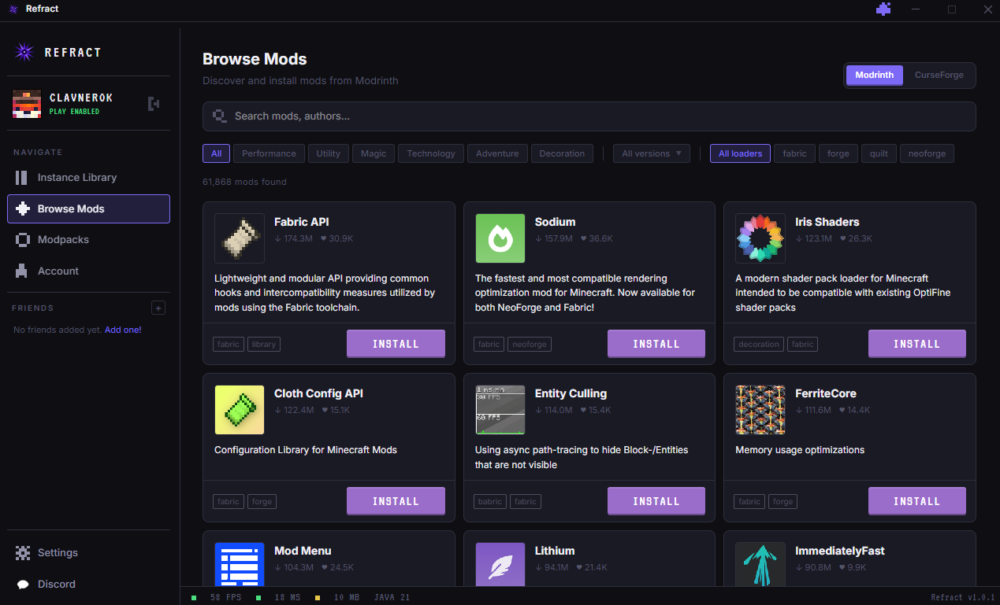

<p align="center">
  
</p>

<h1 align="center">Refract</h1>
<p align="center">A fast, modern Minecraft launcher built with Electron and React.</p>

<p align="center">
  <a href="https://github.com/RefractMC/Refract_MC/releases/latest">
    
  </a>
  
  
</p>

<p align="center">
  
</p>

---

## Features

- **Instance management** — create, group, duplicate, export and delete instances with custom JVM args
- **Microsoft & offline accounts** — full Microsoft device-code login or offline profiles
- **Modrinth & CurseForge** — browse and install mods, resource packs, shaders, datapacks and modpacks
- **Java auto-installer** — automatically downloads the correct JRE (8 / 17 / 21) for each Minecraft version
- **Mod update checker** — badge on instances with outdated mods, one-click update all
- **MultiMC / Prism import** — import instances directly with mods, config and resourcepacks
- **Instance details** — worlds, screenshots and server list per instance
- **Discord Rich Presence** — shows instance name, version and elapsed playtime
- **Playtime tracking** — tracks time spent in each instance
- **Auto-updates** — app updates silently in the background
- **Friends panel** — NameMC links, copy UUID, whitelist helper, inline notes

---

## Download

Get the latest release from the [Releases page](https://github.com/RefractMC/Refract_MC/releases/latest).

| Platform | File |
|---|---|
| Windows | `Refract-x.x.x-setup.exe` |
| Linux (portable) | `Refract-x.x.x.AppImage` |
| Linux (Debian/Ubuntu) | `Refract-x.x.x.deb` |

---

## Development

### Requirements

- [Node.js](https://nodejs.org/) 20+
- [pnpm](https://pnpm.io/) 9+

### Setup

```bash
git clone https://github.com/RefractMC/Refract_MC.git
cd Refract_MC
pnpm install
pnpm dev
```

---

## License

All launcher code is available under the [GPL-3.0-only](LICENSE) license.

The logo and related assets are under the [CC BY-SA 4.0](https://creativecommons.org/licenses/by-sa/4.0/) license.
